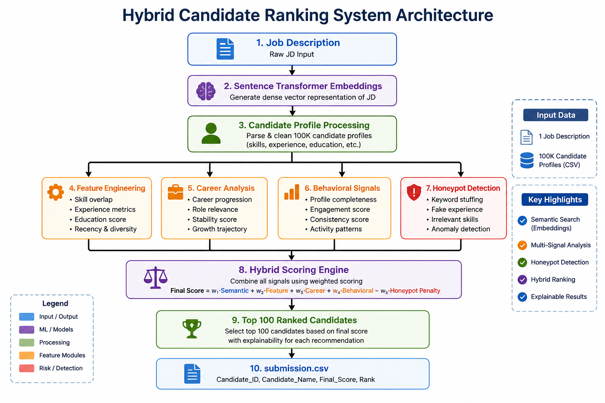

# 🤖 Redrob AI Candidate Discovery & Ranking System

An intelligent candidate ranking system that understands recruiter intent and ranks candidates using semantic search, behavioral signals, career analysis, and hybrid scoring.

---

# 📌 Problem Statement

Traditional keyword-based candidate search often misses strong candidates because it relies only on exact skill matches.

The goal of this project is to build an AI system that:

- Understands what a job description actually means.
- Finds candidates with relevant experience even if keywords differ.
- Uses recruiter-like reasoning to rank candidates.
- Produces an explainable shortlist that recruiters can trust.

---

# 🚀 Solution Overview

Our system combines multiple signals:

- Semantic Embeddings
- Feature Engineering
- Career Analysis
- Behavioral Signals
- Honeypot Detection
- Hybrid Scoring

The final output is a ranked list of the Top 100 candidates.

---

# 🏗️ System Architecture



---

# 🧠 Methodology

## Step 1: Semantic Search

The Job Description and Candidate Profiles are converted into embeddings using:

```text
sentence-transformers/all-MiniLM-L6-v2
```

Cosine similarity is used to measure semantic relevance.

---

## Step 2: Feature Engineering

The system extracts:

- Retrieval experience
- Ranking systems experience
- Recommendation systems
- Vector database experience
- LLM expertise
- Production ML experience
- Product engineering experience

---

## Step 3: Career Analysis

The system analyzes:

- Career history
- Role progression
- Relevant work experience
- Search and ranking system exposure
- Product company experience

---

## Step 4: Behavioral Signals

The following signals are incorporated:

- Open to work flag
- Recruiter response rate
- Interview completion rate
- GitHub activity
- Saved by recruiters
- Notice period

---

## Step 5: Honeypot Detection

The system penalizes suspicious profiles:

- Unrealistic seniority
- Inactive profiles
- Fake engagement signals
- Experience inconsistencies
- Suspicious recruiter activity

---

# ⚙️ Hybrid Scoring Formula

```text
Final Score =
0.20 × Semantic Similarity
+ 0.25 × Title Score
+ 0.20 × Career Score
+ 0.10 × Experience Score
+ 0.10 × Behavioral Score
+ 0.15 × Feature Score
− Honeypot Penalty
```

---

# 📊 Features Used

| Feature | Description |
|---------|-------------|
| Semantic Similarity | Embedding similarity between JD and candidate |
| Title Score | Prior knowledge about role relevance |
| Career Score | Evidence from career history |
| Experience Score | Years of experience fit |
| Behavioral Score | Recruiter engagement signals |
| Feature Score | Retrieval, vector DB, LLM and production experience |
| Honeypot Penalty | Suspicious profile detection |

---

# 🗂️ Dataset

- 100,000 Candidate Profiles
- Structured JSON Candidate Data
- Behavioral Signals
- Career History
- Skills and Experience

---

# 🧩 Technologies Used

- Python
- Pandas
- NumPy
- Sentence Transformers
- Scikit-Learn
- Streamlit
- Git

---

# 📁 Project Structure

```text
Redrob_Hackathon
│
├── app.py
├── architecture.png
├── README.md
├── requirements.txt
├── submission.csv
├── submission_metadata.yaml
│
├── data
├── src
├── embeddings
└── notebooks
```

---

# ▶️ Running the Project

## Install Requirements

```bash
pip install -r requirements.txt
```

## Generate Embeddings

```bash
python src/precompute_embeddings.py
```

## Generate Rankings

```bash
python src/rank.py
```

## Launch Demo

```bash
streamlit run app.py
```

---

# 📈 Output

The system generates:

```text
submission.csv
```

containing:

- Candidate ID
- Rank
- Score
- Explainable Reasoning

---

# 💡 Key Highlights

✅ Semantic Search

✅ Hybrid Ranking

✅ Behavioral Signal Integration

✅ Honeypot Detection

✅ Explainable Recommendations

✅ Streamlit Demo

---

# 🔮 Future Improvements

- Cross Encoder Re-ranking
- Learning-to-Rank Models
- LLM-based Candidate Reasoning
- Real-time Vector Database Integration
- Online Feedback Learning

---

# 👩‍💻 Developed For

Redrob Intelligent Candidate Discovery & Ranking Challenge 2026.